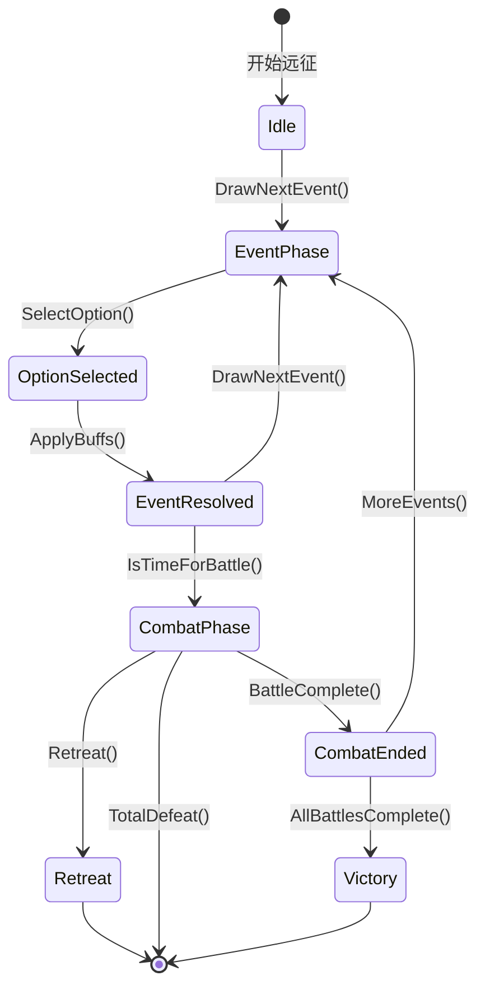

# 卡牌事件系统设计方案

## 1. 系统概述

卡牌事件系统是远征流程（E6）的核心，为行军中的随机事件提供决策机制。根据 GDD：

- **事件结构**：从事件池随机抽取，二选一决策
- **事件效果**：提供临时 Buff/Debuff（普通/稀有/传说三档稀有度）
- **触发时机**：约 4~5 个事件后插入一场战斗
- **流程集成**：编队出征 → 事件链 → 战斗 → 事件链 → ... → 结算

---

## 2. Luban 配置设计

### 2.1 事件表 `event_card.xml`

**定义位置**：`Configs/GameConfig/Defines/event_card.xml`

```xml
<!-- 事件基础表 -->
<bean name="EventCard">
    <field name="Id" value="int" comment="事件ID"/>
    <field name="Name" value="string" comment="事件名称"/>
    <field name="Desc" value="string" comment="事件描述"/>
    <field name="Type" value="EventType" comment="事件类型"/>
    <field name="Option1" value="EventOption" comment="选项1"/>
    <field name="Option2" value="EventOption" comment="选项2"/>
    <field name="Weight" value="int" comment="权重（影响随机概率）"/>
    <field name="MinExpeditionProgress" value="int" comment="最小远征进度（0-3）"/>
    <field name="MaxExpeditionProgress" value="int" comment="最大远征进度"/>
    <field name="Repeatable" value="bool" comment="是否可重复"/>
</bean>

<!-- 事件选项 -->
<bean name="EventOption">
    <field name="OptionText" value="string" comment="选项文字"/>
    <field name="BuffList" value="list<BuffEffect>" comment="获得的Buff"/>
    <field name="DebuffList" value="list<BuffEffect>" comment="获得的Debuff"/>
    <field name="CorruptionReward" value="int" comment="蚀晶奖励（可为负）"/>
    <field name="ExtraEffect" value="ExtraEffectType" comment="额外效果"/>
</bean>

<!-- Buff效果 -->
<bean name="BuffEffect">
    <field name="BuffId" value="int" comment="Buff配置ID"/>
    <field name="Duration" value="int" comment="持续回合数（-1=永久）"/>
</bean>

<!-- 事件类型枚举 -->
<enum name="EventType">
    <item name="Normal" value="0" comment="普通事件"/>
    <item name="Battle" value="1" comment="战斗前置事件"/>
    <item name="Boss" value="2" comment="Boss战前置事件"/>
    <item name="Encounter" value="3" comment="遭遇事件"/>
</enum>

<!-- 额外效果枚举 -->
<enum name="ExtraEffectType">
    <item name="None" value="0" comment="无"/>
    <item name="SpawnReinforcement" value="1" comment="生成增援"/>
    <item name="HealAll" value="2" comment="治疗全队"/>
    <item name="RevealNextEvent" value="3" comment="预览下一个事件"/>
    <item name="SkipNextBattle" value="4" comment="跳过下一场战斗"/>
</enum>
```

### 2.2 Buff表 `buff.xml`

**定义位置**：`Configs/GameConfig/Defines/buff.xml`

```xml
<bean name="BuffConfig">
    <field name="Id" value="int" comment="BuffID"/>
    <field name="Name" value="string" comment="Buff名称"/>
    <field name="Rarity" value="BuffRarity" comment="稀有度"/>
    <field name="Icon" value="string" comment="图标资源路径"/>
    <field name="EffectType" value="BuffEffectType" comment="效果类型"/>
    <field name="EffectValue" value="float" comment="效果数值"/>
    <field name="StackingRule" value="StackingRule" comment="叠加规则"/>
</bean>

<enum name="BuffRarity">
    <item name="Normal" value="0" comment="普通-绿色"/>
    <item name="Rare" value="1" comment="稀有-蓝色"/>
    <item name="Legend" value="2" comment="传说-金色"/>
</enum>

<enum name="BuffEffectType">
    <item name="AttackUp" value="0" comment="攻击力提升%"/>
    <item name="HpUp" value="1" comment="HP提升%"/>
    <item name="SpeedUp" value="2" comment="移速提升%"/>
    <item name="Bounce" value="3" comment="弹性增强"/>
    <item name="Lifesteal" value="4" comment="吸血"/>
    <item name="Heavy" value="5" comment="重型（质量增加）"/>
    <item name="Splash" value="6" comment="溅射伤害"/>
    <item name="Thorns" value="7" comment="荆棘反伤"/>
    <item name="Berserk" value="8" comment="狂暴"/>
    <item name="Rally" value="9" comment="激昂"/>
    <item name="Blessing" value="10" comment="先辈祝福"/>
</enum>

<enum name="StackingRule">
    <item name="None" value="0" comment="不可叠加"/>
    <item name="Intensity" value="1" comment="强度叠加"/>
    <item name="Duration" value="2" comment="时间叠加"/>
</enum>
```

---

## 3. 代码架构设计

### 3.1 目录结构

```
Gameplay/Expedition/
├── ExpeditionManager.cs          # 远征管理器（核心）
├── EventCardManager.cs           # 事件卡牌管理器
├── ExpeditionRuntimeData.cs      # 远征运行时数据
├── Buff/
│   ├── BuffComponent.cs         # Buff组件（挂在Marble上）
│   └── BuffEffect/
│       ├── IBuffEffect.cs        # Buff效果接口
│       ├── AttackUpBuff.cs       # 攻击提升
│       ├── SpeedUpBuff.cs        # 移速提升
│       └── ... (其他Buff效果)
├── EventCard/
│   ├── EventCardData.cs         # 事件卡牌数据
│   └── IEventEffect.cs          # 事件效果接口
└── UI/
    ├── EventCardUI.cs           # 事件卡牌界面
    └── EventCardUIWidget.cs     # 卡牌组件
```

### 3.2 核心类设计

**ExpeditionManager（远征管理器）**

```csharp
// 核心职责：管理远征状态、事件流程、Buff生命周期
public class ExpeditionManager : Singleton<ExpeditionManager>
{
    // 状态
    public ExpeditionState State { get; }
    public ExpeditionRuntimeData RuntimeData { get; }
    public IReadOnlyList<BuffInstance> ActiveBuffs { get; }
    
    // 核心方法
    public void StartExpedition(ExpeditionConfig config);
    public void DrawNextEvent();           // 抽取下一个事件
    public void SelectOption(int optionIndex);  // 选择选项
    public void TriggerCombat();            // 触发战斗
    public void Retreat();                  // 撤退
    public void EndExpedition(ExpeditionResult result);  // 结束远征
    
    // Buff管理
    public void ApplyBuff(BuffInstance buff);
    public void RemoveBuff(int buffId);
    public void TickBuffDuration();        // 每回合减少Buff持续时间
}
```

**EventCardManager（事件卡牌管理器）**

```csharp
// 核心职责：从配置随机抽取事件、管理事件池
public class EventCardManager
{
    private List<EventCardData> _availableEvents;
    private List<EventCardData> _usedEvents;
    
    public EventCardData DrawEvent(int expeditionProgress);
    public void ReturnEvent(EventCardData card);  // 归还到池中
    public void ResetEventPool();
}
```

**BuffComponent（Buff组件）**

```csharp
// 挂在Marble上，处理Buff效果
public class BuffComponent
{
    public void ApplyBuff(BuffConfig config, int duration);
    public void RemoveBuff(int buffId);
    public float GetAttackMultiplier();  // 用于伤害计算
    public float GetSpeedMultiplier();
    public float GetMaxHpMultiplier();
    // ... 其他属性
}
```

---

## 4. 事件流程设计

### 4.1 远征状态机




### 4.2 流程集成

**ProcedureExpedition.cs** - 远征流程

```csharp
public class ProcedureExpedition : ProcedureBase
{
    private ExpeditionManager _expeditionManager;
    
    public override async UniTask<bool> OnEnter(IFsm<IProcedureHandler> owner)
    {
        // 1. 初始化远征
        var config = GetExpeditionConfig();
        _expeditionManager.StartExpedition(config);
        
        // 2. 显示远征UI
        await GameModule.UI.ShowUIAsyncAwait<ExpeditionMainUI>();
        
        // 3. 循环事件流程
        while (!_expeditionManager.IsCompleted)
        {
            // 抽取事件
            var card = _expeditionManager.DrawNextEvent();
            await ShowEventCard(card);  // 显示卡牌UI
            await WaitForPlayerChoice(); // 等待玩家选择
            
            // 应用效果
            _expeditionManager.SelectOption(_selectedOption);
            ApplyEventEffects();
            
            // 判断是否触发战斗
            if (_expeditionManager.ShouldTriggerCombat())
            {
                await TransitionToCombat();
            }
        }
        
        // 4. 结算
        await ShowExpeditionResult();
        return true;
    }
}
```

---

## 5. UI 设计

### 5.1 事件卡牌界面 EventCardUI

**布局**：

```
┌────────────────────────────────────────────┐
│            [当前进度: 2/5 事件]              │
│                                            │
│  ┌─────────────┐       ┌─────────────┐    │
│  │             │       │             │    │
│  │   选项A      │       │   选项B      │    │
│  │             │       │             │    │
│  │ [Buff图标]   │       │ [Buff图标]   │    │
│  │ +20% 攻击    │       │ +100% 攻击   │    │
│  │ +30% HP     │       │ -50% 防御    │    │
│  │             │       │             │    │
│  └─────────────┘       └─────────────┘    │
│                                            │
│         [事件描述文字区域]                   │
└────────────────────────────────────────────┘
```

**交互**：

- 点击卡片选择选项
- Hover 显示详细Buff说明
- 选中后卡片放大高亮
- 点击确认按钮应用选择

### 5.2 界面层级

```csharp
[Window(UILayer.Popup)]
class EventCardUI : UIWindow
{
    // 显示事件卡牌
    public void ShowEvent(EventCardData card);
    // 更新选项显示
    public void UpdateOptions(EventOption option1, EventOption option2);
    // 播放选择动画
    public void PlaySelectAnimation(int optionIndex);
}
```

---

## 6. Buff与战斗系统集成

### 6.1 Buff效果实现

每个Buff效果实现 `IBuffEffect` 接口：

```csharp
public interface IBuffEffect
{
    BuffEffectType Type { get; }
    void OnApply(Marble marble);
    void OnRemove(Marble marble);
    void OnTick(Marble marble);  // 每帧或每回合触发
}

// 示例：攻击力提升
public class AttackUpBuffEffect : IBuffEffect
{
    public BuffEffectType Type => BuffEffectType.AttackUp;
    private float _multiplier;
    
    public void OnApply(Marble marble)
    {
        marble.RuntimeData.Config.DamageMultiplier += _multiplier;
    }
    
    public void OnRemove(Marble marble)
    {
        marble.RuntimeData.Config.DamageMultiplier -= _multiplier;
    }
}
```

### 6.2 BuffComponent挂载点

```csharp
// MarbleRuntimeData 中增加 BuffComponent 引用
public class MarbleRuntimeData
{
    public BuffComponent BuffComp { get; set; }
}

// MarbleFactory 中初始化
public static class MarbleFactory
{
    public static Marble Create(...)
    {
        marble.RuntimeData.BuffComp = new BuffComponent(marble);
        // ...
    }
}
```

---

## 7. 实现顺序建议

### Phase 1: 基础框架

1. 创建 `ExpeditionManager` 远征管理器
2. 创建 `EventCardManager` 事件管理器
3. 设计 Luban 配置表
4. 实现基础Buff数据结构和枚举

### Phase 2: UI界面

1. 创建 `EventCardUI` 事件卡牌界面
2. 实现卡牌动画和交互
3. 集成 UI → 事件管理器

### Phase 3: 流程集成

1. 创建 `ProcedureExpedition` 远征流程
2. 实现状态机和流程切换
3. 集成战斗流程 → 远征流程

### Phase 4: Buff效果实现

1. 实现 `BuffComponent` 组件
2. 实现各类型Buff效果类
3. 集成Buff → Marble战斗系统

---

## 8. 待确认事项

1. **事件池大小**：预计需要多少张事件卡牌？（GDD提到~30张）
2. **Buff数值平衡**：各Buff的效果数值是否已有规划？
3. **UI风格**：是否沿用现有的 UI 框架风格？
4. **与其他系统联动**：Buff如何影响战斗结算？

---

## 9. 参考文件

- 现有流程实现：`UnityProject/Assets/GameScripts/Procedure/ProcedureStartGame.cs`
- UI框架使用：`UnityProject/Assets/GameScripts/HotFix/GameLogic/Module/UIModule/UIWindow.cs`
- Combat系统集成点：`UnityProject/Assets/GameScripts/HotFix/GameLogic/Gameplay/Combat/CombatManager.cs`

